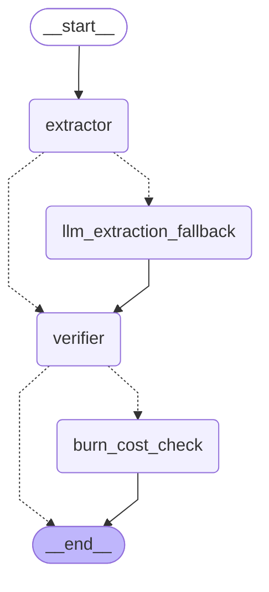
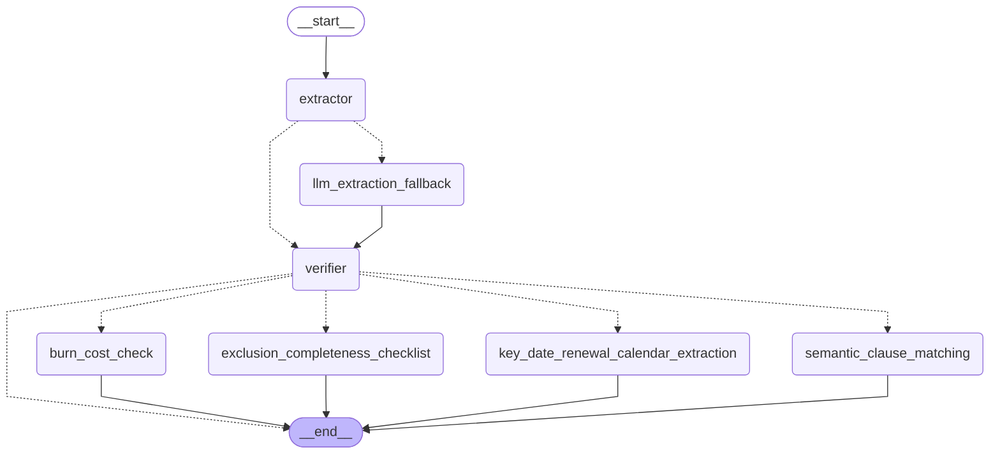

# reinsurance-treaty-agent
Reinsurance Treaty Analyzer Agent. Tech Stack: Python 3.11+, Pydantic v2, LangGraph (for deterministic agent orchestration), FastAPI (for API/services), Pytest (testing), Docker &amp; Streamlit (for easy deployment &amp; UI). AI Tooling: Claude Code (CLI) inside PyCharm, interacting with Claude 3.5 Sonnet via Anthropic API.

**Live demo**: [reinsurance-treaty-agent-extraction.streamlit.app](https://reinsurance-treaty-agent-extraction.streamlit.app/)

## Workflow Graph

The agentic workflow in `src/workflow.py` is a LangGraph state machine:
the Extractor Node reads treaty terms from parsed text via regex; if
it can't find one or more required fields (e.g. a treaty phrased as
prose instead of the `Label: value` convention), the LLM Extraction
Fallback Node attempts extraction using Claude Haiku 4.5 with
structured tool-use output before continuing. That call goes through
the LLM-calling harness in `src/llm_client.py`, which automatically
retries a transient failure (timeout, network hiccup, rate limit,
momentary server overload) up to twice with exponential backoff before
giving up — a non-transient failure (e.g. an invalid API key) is not
retried. On success, `check_treaty_grounding()` (`src/tools.py`) then
verifies each extracted field against its cited page's actual text,
flagging (not blocking) any field the source text doesn't actually
support. The Verifier Node then checks completeness and (if complete)
looks up historical claims for the cedent, and the Burn-Cost Check
Node computes the loss ratio and flags anomalies. If extraction is
still incomplete after the LLM fallback (including its retries), the
graph ends right after the Verifier Node instead of running the
Burn-Cost Check Node. The graph builder (`build_workflow_graph()`)
also accepts an optional set of selected domain-task IDs (defaulting
to just the Burn-Cost Check) — only implemented tasks in that set
(per `src/domain_tasks.py`'s registry) get wired in after the Verifier
Node; this is currently the only implemented task, in preparation for
future domain tasks (see `CANDIDATE_TASKS.md`'s Multi Domain-Task
Selection section).

<!-- workflow-graph:start -->

<!-- workflow-graph:end -->

This diagram shows the *default* selection (just the Burn-Cost Check)
— what a fresh page load runs before any other domain task is checked.
It's regenerated automatically by a pre-commit hook whenever
`src/workflow.py` changes (see `scripts/regenerate_workflow_graph.py`
and `## Setup` below). To regenerate it by hand:

```bash
python3 scripts/regenerate_workflow_graph.py
```

### Workflow Graph (Multi-Task Example)

`build_workflow_graph()` also accepts an explicit set of selected
domain-task IDs, fanning the Verifier Node out to every implemented
task in that set. The diagram below shows every domain task actually
implemented today (`src/domain_tasks.py`'s `DOMAIN_TASKS` registry)
running in parallel after the Verifier Node — a real selection, not a
mocked/hypothetical one, and it grows on its own as more tasks are
implemented:

<!-- workflow-graph-multi-task:start -->

<!-- workflow-graph-multi-task:end -->

This diagram is regenerated by the same script and pre-commit hook as
the default-selection one above (it's not tied to what any single
user selects in the running app — its selection is computed by
`get_multi_task_selected_ids()` in `scripts/regenerate_workflow_
graph.py` as every task in `DOMAIN_TASKS` with
`implementation_status == "implemented"`, so it updates automatically
whenever a task's implementation status changes, not just when the
shared pipeline nodes/edges change).

## Setup

```bash
python3 -m venv venv
source venv/bin/activate   # Windows: venv\Scripts\activate
pip install -r requirements.txt
git config core.hooksPath .githooks
```

That last command enables `.githooks/pre-commit`, which automatically
regenerates the workflow graph diagrams (above) in `README.md` whenever
`src/workflow.py` or `src/domain_tasks.py` is part of a commit.

## Running the App

```bash
streamlit run src/app.py
```

Run this from the project root with the venv active. `src/app.py`
inserts the project root into `sys.path` itself at the top of the
file, before its `from src... import` statements — needed because
Streamlit's own script runner (`streamlit/web/bootstrap.py`) only adds
the script's own directory (`src/`) to `sys.path`, not the project
root, whichever way the app is launched (bare `streamlit run`,
`python3 -m streamlit run`, or Streamlit Community Cloud's own
launcher — see "Deployment" below). `python3 -m streamlit run
src/app.py` also still works, since `-m` additionally puts the project
root on `sys.path` in its own right.

Streamlit starts a local web server and prints a URL, typically:

```
Local URL: http://localhost:8501
```

Open that URL in a browser (it usually opens automatically). Leave the
command running in its terminal — the app stays up as long as that
process does; press `Ctrl+C` there to stop it.

### Using the app

1. **Upload a treaty PDF** via the "Treaty PDF" file uploader. Three
   mock fixtures ship in `data/` for trying it out: `sample_treaty.pdf`
   (minimal, 2 pages), `sample_rich_treaty.pdf` (detailed, 4 pages, two
   layers), and `sample_rich_fuzzy_treaty.pdf` (same facts as the rich
   fixture but phrased as prose, so it needs the LLM Extraction
   Fallback — see [Sample Treaty Fixtures](#sample-treaty-fixtures)
   below).
2. The app runs the full agent workflow automatically on upload and
   renders the resulting anomaly report: treaty terms with page
   citations, the historical loss ratio, and any flagged findings. If a
   treaty needed the LLM Extraction Fallback (regex alone couldn't find
   required fields), a note above the report says so. If the LLM call
   hits a transient failure (a timeout, a network hiccup, a momentary
   rate limit or server overload), it's retried automatically — up to
   2 retries with exponential backoff (1s, then 2s) — before giving up;
   a non-transient failure (e.g. an invalid API key) fails immediately,
   unretried. An unreadable/malformed PDF, or one where both regex and
   the LLM fallback (including all its retries) fail to find required
   treaty terms, shows a clear error message instead of crashing —
   including the LLM failure reason, if that's what happened. If the
   LLM Extraction Fallback succeeds, each extracted field with a page
   citation is also checked against that cited page's actual text (a
   deterministic grounding check, not another LLM call); any field
   that doesn't check out — the LLM may have gotten it wrong — is
   flagged with a warning naming the field, rather than silently
   trusted.
3. Expand **"Debug: workflow execution"** below the report to see:
   - A caption naming which extraction path this run took (Regex only,
     LLM Extraction Fallback, or both attempts failed and why).
   - A per-node execution log (Extractor (Regex) → [LLM Extraction
     Fallback] → Verifier → Burn-Cost Check), each line timestamped — including
     a line for each retry attempt if a transient LLM failure occurred,
     noting the backoff delay before the next attempt.
   - The raw workflow state as JSON (parsed sections, extracted treaty
     terms, `extraction_method`, `llm_error`, claims, the final
     report).
   - A save control: pick **Append** or **Overwrite**, then click
     **"Save logs to file"** to write the current run's log lines —
     prefixed with a header noting the run's date/time and uploaded
     file name — to `logs/workflow.log`. Append adds to that file's
     existing content; Overwrite clears it first.
4. To try another treaty, upload a different PDF — the app reruns
   automatically and replaces the report and debug panel with the new
   run's results.

## Deployment

The app is deployed on [Streamlit Community Cloud](https://share.streamlit.io/),
which is free and purpose-built for Streamlit apps, but has no public
deploy API — the app is created and updated through its web UI, not a
CLI or GitHub Action. It requires the GitHub repo to be **public**
(this repo is) — Community Cloud's free tier doesn't deploy from
private repos.

### First-time setup (manual, one-time)

1. Sign in at [share.streamlit.io](https://share.streamlit.io/) with
   GitHub.
2. Click **"Create app"** → **"Deploy a public app from GitHub"**.
3. Fill in:
   - **Repository**: `iva2020dev/reinsurance-treaty-agent`
   - **Branch**: `main`
   - **Main file path**: `src/app.py`
4. Click **Deploy**. The platform installs `requirements.txt` and runs
   `streamlit run src/app.py` from the repo root.
5. Add the **`ANTHROPIC_API_KEY`** secret: on the app's page, open
   **Settings → Secrets** and add
   `ANTHROPIC_API_KEY = "sk-ant-..."`. Extraction is regex-first (see
   `REASONING.md`'s `build-agentic-workflow-graph` entry) and needs no
   secret on its own, but the LLM Extraction Fallback
   (`llm_extraction_fallback`, used when regex can't find required
   fields — see `implement-llm-fallback-node`) makes a real Anthropic
   API call and needs this key to work. Without it, the app still runs
   fine on
   well-formed treaties; on ones that need the fallback, the run
   degrades gracefully (an incomplete-extraction message) rather than
   crashing — it just can't actually recover via the LLM.
6. Once deployed, the app gets a permanent public URL
   (`https://<app-name>.streamlit.app`). This app is live at
   [reinsurance-treaty-agent-extraction.streamlit.app](https://reinsurance-treaty-agent-extraction.streamlit.app/).

### Keeping it up to date

Streamlit Community Cloud auto-redeploys on every push to `main` — no
separate deploy step is needed after the first setup. A push that adds
a new dependency to `requirements.txt` triggers a full reinstall on the
next redeploy.

### Compatibility note

Streamlit Cloud's launcher behaves like a bare `streamlit run src/app.py`
(not `python -m streamlit run`), which only adds `src/`'s own directory
to `sys.path`, not the repo root. `src/app.py` accounts for this itself
— it inserts the repo root into `sys.path` at the top of the file
before its `src.*` imports — so it resolves correctly under Streamlit
Cloud's launcher without needing the `-m` flag documented above for
local runs.

## Running Tests

Tests live under `tests/` and are run with `pytest` from the project root
(so `src/` and `data/` resolve as relative paths).

Run the full suite:

```bash
python3 -m pytest tests/
```

Run with per-test output (`-v`):

```bash
python3 -m pytest tests/ -v
```

Example output:

```
============================= test session starts ==============================
collected 73 items

tests/eval/test_eval_suite.py::test_score_case_regex_path_cases_are_fully_correct PASSED [  1%]
tests/eval/test_eval_suite.py::test_score_case_llm_path_correct_response_scores_perfectly PASSED [  2%]
tests/eval/test_eval_suite.py::test_score_case_flags_incorrect_field_from_corrupted_extraction PASSED [  4%]
tests/eval/test_eval_suite.py::test_run_eval_overall_accuracy_drops_when_a_case_regresses PASSED [  5%]
tests/eval/test_eval_suite.py::test_score_case_handles_llm_failure_without_crashing PASSED [  6%]
tests/eval/test_eval_suite.py::test_score_exclusions_matches_paraphrased_clauses_not_just_exact_strings PASSED [  8%]
tests/test_app.py::test_format_report_markdown_includes_terms_citations_and_findings PASSED [  9%]
tests/test_app.py::test_format_report_markdown_no_findings PASSED        [ 10%]
tests/test_app.py::test_analyze_uploaded_pdf_success PASSED              [ 12%]
tests/test_app.py::test_analyze_uploaded_pdf_malformed_raises_parser_error PASSED [ 13%]
tests/test_app.py::test_app_upload_and_render_success PASSED             [ 15%]
tests/test_app.py::test_app_upload_malformed_pdf_shows_error_not_crash PASSED [ 16%]
tests/test_app.py::test_serialize_state_for_debug_is_json_safe PASSED    [ 17%]
tests/test_app.py::test_app_debug_panel_shows_log_lines_and_state_on_success PASSED [ 19%]
tests/test_app.py::test_app_debug_panel_shows_log_lines_on_parser_failure PASSED [ 20%]
tests/test_app.py::test_format_extraction_status_for_each_extraction_method PASSED [ 21%]
tests/test_app.py::test_app_shows_llm_extraction_fallback_note_and_state_on_success PASSED [ 23%]
tests/test_app.py::test_app_shows_ungrounded_field_warning_when_grounding_check_fails PASSED [ 24%]
tests/test_app.py::test_app_shows_llm_error_when_both_extraction_paths_fail PASSED [ 26%]
tests/test_app.py::test_format_log_header_includes_timestamp_and_filename PASSED [ 27%]
tests/test_app.py::test_save_logs_to_file_overwrite_replaces_existing_content PASSED [ 28%]
tests/test_app.py::test_save_logs_to_file_append_keeps_existing_content PASSED [ 30%]
tests/test_app.py::test_save_logs_to_file_creates_parent_directory PASSED [ 31%]
tests/test_app.py::test_app_save_button_writes_default_log_file PASSED   [ 32%]
tests/test_integration.py::test_full_pipeline_success_minimal_treaty PASSED [ 34%]
tests/test_integration.py::test_full_pipeline_success_rich_treaty PASSED [ 35%]
tests/test_integration.py::test_full_pipeline_malformed_pdf_raises_parser_error PASSED [ 36%]
tests/test_integration.py::test_full_pipeline_unknown_cedent_handled_gracefully PASSED [ 38%]
tests/test_integration.py::test_full_pipeline_missing_required_term_handled_gracefully PASSED [ 39%]
tests/test_integration.py::test_full_pipeline_llm_extraction_fallback_real_api_call PASSED [ 41%]
tests/test_llm_client.py::test_get_client_disables_the_sdks_own_silent_retries PASSED [ 42%]
tests/test_llm_client.py::test_call_with_retry_returns_result_on_first_success PASSED [ 43%]
tests/test_llm_client.py::test_call_with_retry_retries_transient_failure_then_succeeds PASSED [ 45%]
tests/test_llm_client.py::test_call_with_retry_uses_exponential_backoff_across_multiple_retries PASSED [ 46%]
tests/test_llm_client.py::test_call_with_retry_respects_custom_max_retries_and_base_delay PASSED [ 47%]
tests/test_llm_client.py::test_call_with_retry_raises_last_exception_after_exhausting_retries PASSED [ 49%]
tests/test_llm_client.py::test_call_with_retry_does_not_retry_a_non_retryable_exception PASSED [ 50%]
tests/test_llm_client.py::test_call_with_retry_treats_a_plain_exception_as_non_retryable PASSED [ 52%]
tests/test_llm_client.py::test_call_with_retry_retries_all_documented_retryable_exception_types PASSED [ 53%]
tests/test_llm_client.py::test_call_with_retry_logs_each_attempt_with_the_given_description PASSED [ 54%]
tests/test_parser.py::test_extract_treaty_sections_handles_minimal_two_page_treaty PASSED [ 56%]
tests/test_parser.py::test_extract_treaty_sections_handles_rich_multi_page_treaty PASSED [ 57%]
tests/test_parser.py::test_extract_treaty_sections_handles_fuzzy_rich_treaty PASSED [ 58%]
tests/test_parser.py::test_extract_treaty_sections_raises_on_malformed_pdf PASSED [ 60%]
tests/test_parser.py::test_extract_treaty_sections_raises_on_missing_file PASSED [ 61%]
tests/test_tools.py::test_query_historical_claims_returns_claims_for_known_cedent PASSED [ 63%]
tests/test_tools.py::test_query_historical_claims_returns_empty_list_for_unknown_cedent PASSED [ 64%]
tests/test_tools.py::test_calculate_loss_ratio_known_inputs PASSED       [ 65%]
tests/test_tools.py::test_calculate_loss_ratio_empty_claims_is_zero PASSED [ 67%]
tests/test_tools.py::test_check_treaty_grounding_all_fields_supported_by_cited_pages PASSED [ 68%]
tests/test_tools.py::test_check_treaty_grounding_flags_unsupported_cedent_name PASSED [ 69%]
tests/test_tools.py::test_check_treaty_grounding_flags_unsupported_numeric_value PASSED [ 71%]
tests/test_tools.py::test_check_treaty_grounding_flags_unsupported_exclusion PASSED [ 72%]
tests/test_tools.py::test_check_treaty_grounding_flags_citation_pointing_at_missing_page PASSED [ 73%]
tests/test_tools.py::test_check_treaty_grounding_tolerates_hyphenated_word_broken_across_line_wrap PASSED [ 75%]
tests/test_tools.py::test_check_treaty_grounding_skips_fields_with_no_citation PASSED [ 76%]
tests/test_tools.py::test_calculate_loss_ratio_claim_exceeding_layer_top_is_capped PASSED [ 78%]
tests/test_workflow.py::test_extractor_node_well_formed_input PASSED     [ 79%]
tests/test_workflow.py::test_extractor_node_flags_missing_fields PASSED  [ 80%]
tests/test_workflow.py::test_extract_treaty_terms_fails_on_fuzzy_prose_treaty PASSED [ 82%]
tests/test_workflow.py::test_llm_extraction_fallback_not_invoked_when_regex_succeeds PASSED [ 83%]
tests/test_workflow.py::test_llm_extraction_fallback_succeeds_on_fuzzy_treaty PASSED [ 84%]
tests/test_workflow.py::test_llm_extraction_fallback_flags_ungrounded_field_but_still_completes PASSED [ 86%]
tests/test_workflow.py::test_run_workflow_via_llm_extraction_fallback_flags_medium_finding PASSED [ 87%]
tests/test_workflow.py::test_llm_extraction_fallback_degrades_gracefully_on_failure PASSED [ 89%]
tests/test_workflow.py::test_llm_extraction_fallback_retries_transient_failure_then_succeeds PASSED [ 90%]
tests/test_workflow.py::test_llm_extraction_fallback_gives_up_after_max_retries PASSED [ 91%]
tests/test_workflow.py::test_run_workflow_stays_incomplete_when_llm_extraction_fallback_also_fails PASSED [ 93%]
tests/test_workflow.py::test_verifier_node_complete_triggers_historical_claims_lookup PASSED [ 94%]
tests/test_workflow.py::test_verifier_node_flags_incompleteness_without_calling_tools PASSED [ 95%]
tests/test_workflow.py::test_analyst_node_no_anomalies PASSED            [ 97%]
tests/test_workflow.py::test_analyst_node_flags_at_least_one_anomaly PASSED [ 98%]
tests/test_workflow_graph_docs.py::test_readme_workflow_graph_matches_live_graph PASSED [100%]

============================== 73 passed in 7.26s ==============================
```

Run a single test file, e.g. just the parser tests:

```bash
python3 -m pytest tests/test_parser.py -v
```

Example output:

```
============================= test session starts ==============================
collected 5 items

tests/test_parser.py::test_extract_treaty_sections_handles_minimal_two_page_treaty PASSED [ 20%]
tests/test_parser.py::test_extract_treaty_sections_handles_rich_multi_page_treaty PASSED [ 40%]
tests/test_parser.py::test_extract_treaty_sections_handles_fuzzy_rich_treaty PASSED [ 60%]
tests/test_parser.py::test_extract_treaty_sections_raises_on_malformed_pdf PASSED [ 80%]
tests/test_parser.py::test_extract_treaty_sections_raises_on_missing_file PASSED [100%]

============================== 5 passed in 0.04s ===============================
```

Run a single test by name:

```bash
python3 -m pytest tests/test_parser.py::test_extract_treaty_sections_handles_minimal_two_page_treaty -v
```

Example output:

```
============================= test session starts ==============================
collected 1 item

tests/test_parser.py::test_extract_treaty_sections_handles_minimal_two_page_treaty PASSED [100%]

============================== 1 passed in 0.06s ===============================
```

Run both treaty-fixture tests by keyword, to compare the minimal and
rich fixtures side by side:

```bash
python3 -m pytest tests/test_parser.py -k "minimal_two_page_treaty or rich_multi_page_treaty" -v
```

Example output:

```
============================= test session starts ==============================
collected 5 items / 3 deselected / 2 selected

tests/test_parser.py::test_extract_treaty_sections_handles_minimal_two_page_treaty PASSED [ 50%]
tests/test_parser.py::test_extract_treaty_sections_handles_rich_multi_page_treaty PASSED [100%]

======================= 2 passed, 3 deselected in 0.03s ========================
```

Now clearly distinct, symmetric names — both pass:

| Test | Fixture | Pages | Checks |
|---|---|---|---|
| `test_extract_treaty_sections_handles_minimal_two_page_treaty` | `sample_treaty.pdf` | 2 | page 1 has "Attachment Point", page 2 has "EXCLUSIONS" |
| `test_extract_treaty_sections_handles_rich_multi_page_treaty` | `sample_rich_treaty.pdf` | 4 | page 1 cedent name, page 2 "Layer 1", page 3 "EXCLUSIONS", page 4 "Arbitration" |
| `test_extract_treaty_sections_handles_fuzzy_rich_treaty` | `sample_rich_fuzzy_treaty.pdf` | 4 | page 1 has "Sentinel Mutual", page 2 has "$200,000", page 3 "EXCLUSIONS", page 4 "Arbitration" |

Run just the tools tests (`query_historical_claims` and
`calculate_loss_ratio`, from `src/tools.py`):

```bash
python3 -m pytest tests/test_tools.py -v
```

Example output:

```
============================= test session starts ==============================
collected 12 items

tests/test_tools.py::test_query_historical_claims_returns_claims_for_known_cedent PASSED [  8%]
tests/test_tools.py::test_query_historical_claims_returns_empty_list_for_unknown_cedent PASSED [ 16%]
tests/test_tools.py::test_calculate_loss_ratio_known_inputs PASSED       [ 25%]
tests/test_tools.py::test_calculate_loss_ratio_empty_claims_is_zero PASSED [ 33%]
tests/test_tools.py::test_check_treaty_grounding_all_fields_supported_by_cited_pages PASSED [ 41%]
tests/test_tools.py::test_check_treaty_grounding_flags_unsupported_cedent_name PASSED [ 50%]
tests/test_tools.py::test_check_treaty_grounding_flags_unsupported_numeric_value PASSED [ 58%]
tests/test_tools.py::test_check_treaty_grounding_flags_unsupported_exclusion PASSED [ 66%]
tests/test_tools.py::test_check_treaty_grounding_flags_citation_pointing_at_missing_page PASSED [ 75%]
tests/test_tools.py::test_check_treaty_grounding_tolerates_hyphenated_word_broken_across_line_wrap PASSED [ 83%]
tests/test_tools.py::test_check_treaty_grounding_skips_fields_with_no_citation PASSED [ 91%]
tests/test_tools.py::test_calculate_loss_ratio_claim_exceeding_layer_top_is_capped PASSED [100%]

============================== 12 passed in 0.04s ===============================
```

| Test | Checks |
|---|---|
| `test_query_historical_claims_returns_claims_for_known_cedent` | "Acme Insurance Co." returns its 3 rows from `data/historical_claims.csv`, amounts sum correctly |
| `test_query_historical_claims_returns_empty_list_for_unknown_cedent` | An unmatched cedent name returns `[]`, not an error |
| `test_calculate_loss_ratio_known_inputs` | A claim below the attachment point cedes 0; a claim partially above it cedes the portion within the layer |
| `test_calculate_loss_ratio_empty_claims_is_zero` | No claims → ratio of `0.0` |
| `test_check_treaty_grounding_all_fields_supported_by_cited_pages` | A line-wrapped cedent name and `$`-formatted numbers still match their cited page's text (whitespace/format tolerant) |
| `test_check_treaty_grounding_flags_unsupported_cedent_name` | A cedent name absent from its cited page is flagged |
| `test_check_treaty_grounding_flags_unsupported_numeric_value` | A numeric value with no numerically-equivalent match on its cited page is flagged |
| `test_check_treaty_grounding_flags_unsupported_exclusion` | An exclusion item absent from its cited page is flagged |
| `test_check_treaty_grounding_flags_citation_pointing_at_missing_page` | A citation pointing at a page number that doesn't exist is flagged |
| `test_check_treaty_grounding_tolerates_hyphenated_word_broken_across_line_wrap` | A hyphenated word split across a PDF line wrap (e.g. "asbestos-\nrelated") is still recognized as grounded |
| `test_check_treaty_grounding_skips_fields_with_no_citation` | A field absent from `page_citations` isn't checked at all, even if its value wouldn't match any page |
| `test_calculate_loss_ratio_claim_exceeding_layer_top_is_capped` | A claim far exceeding the layer's top is capped at the limit → ratio of `1.0` |

Run just the workflow tests (the Extractor/Verifier/Burn-Cost Check
nodes, from `src/workflow.py`):

```bash
python3 -m pytest tests/test_workflow.py -v
```

Example output:

```
============================= test session starts ==============================
collected 15 items

tests/test_workflow.py::test_extractor_node_well_formed_input PASSED     [  6%]
tests/test_workflow.py::test_extractor_node_flags_missing_fields PASSED  [ 13%]
tests/test_workflow.py::test_extract_treaty_terms_fails_on_fuzzy_prose_treaty PASSED [ 20%]
tests/test_workflow.py::test_llm_extraction_fallback_not_invoked_when_regex_succeeds PASSED [ 26%]
tests/test_workflow.py::test_llm_extraction_fallback_succeeds_on_fuzzy_treaty PASSED [ 33%]
tests/test_workflow.py::test_llm_extraction_fallback_flags_ungrounded_field_but_still_completes PASSED [ 40%]
tests/test_workflow.py::test_run_workflow_via_llm_extraction_fallback_flags_medium_finding PASSED [ 46%]
tests/test_workflow.py::test_llm_extraction_fallback_degrades_gracefully_on_failure PASSED [ 53%]
tests/test_workflow.py::test_llm_extraction_fallback_retries_transient_failure_then_succeeds PASSED [ 60%]
tests/test_workflow.py::test_llm_extraction_fallback_gives_up_after_max_retries PASSED [ 66%]
tests/test_workflow.py::test_run_workflow_stays_incomplete_when_llm_extraction_fallback_also_fails PASSED [ 73%]
tests/test_workflow.py::test_verifier_node_complete_triggers_historical_claims_lookup PASSED [ 80%]
tests/test_workflow.py::test_verifier_node_flags_incompleteness_without_calling_tools PASSED [ 86%]
tests/test_workflow.py::test_analyst_node_no_anomalies PASSED            [ 93%]
tests/test_workflow.py::test_analyst_node_flags_at_least_one_anomaly PASSED [100%]

============================== 15 passed in 0.33s ===============================
```

| Test | Checks |
|---|---|
| `test_extractor_node_well_formed_input` | Regex extraction reads cedent/attachment point/limit/premium/exclusions and their page citations from clean `Label: value` text |
| `test_extractor_node_flags_missing_fields` | Sections missing numeric fields return `treaty=None` plus the list of missing field names, instead of raising |
| `test_extract_treaty_terms_fails_on_fuzzy_prose_treaty` | The prose-phrased fuzzy fixture (same facts as the rich fixture) returns `treaty=None` and all four required fields as missing, since regex can't match `Label: value` patterns in natural prose |
| `test_llm_extraction_fallback_not_invoked_when_regex_succeeds` | Patching `llm_extraction_fallback` to raise if called confirms it never runs on a well-formed treaty |
| `test_llm_extraction_fallback_succeeds_on_fuzzy_treaty` | Given the fuzzy fixture's sections and a mocked successful Claude tool-use response, produces a valid `TreatyTerms` with `extraction_method="llm"` and no ungrounded fields |
| `test_llm_extraction_fallback_flags_ungrounded_field_but_still_completes` | A mocked response whose cited page doesn't actually support the claimed cedent name is flagged in `ungrounded_fields`, but extraction still completes |
| `test_run_workflow_via_llm_extraction_fallback_flags_medium_finding` | End-to-end: regex fails, the (mocked) LLM extraction fallback succeeds, and the real $900,000 historical claim against the extracted layer produces a non-zero loss ratio (0.70) and one `MEDIUM` finding |
| `test_llm_extraction_fallback_degrades_gracefully_on_failure` | A simulated API failure returns `extraction_method="none"` and a populated `llm_error`, without raising |
| `test_llm_extraction_fallback_retries_transient_failure_then_succeeds` | A mocked transient failure (timeout) followed by success retries once (one backoff sleep) and produces a correct result |
| `test_llm_extraction_fallback_gives_up_after_max_retries` | A transient failure that never recovers exhausts all retries (3 total attempts, 2 backoff sleeps) and still degrades gracefully |
| `test_run_workflow_stays_incomplete_when_llm_extraction_fallback_also_fails` | End-to-end: regex fails, the LLM extraction fallback also fails (mocked), and the run ends with `complete=False`, not a crash |
| `test_verifier_node_complete_triggers_historical_claims_lookup` | A valid treaty triggers a real `query_historical_claims` call and returns the cedent's claims |
| `test_verifier_node_flags_incompleteness_without_calling_tools` | `treaty=None` marks the run incomplete and skips the tool call entirely (empty claims) |
| `test_burn_cost_check_node_no_anomalies` | A moderate loss ratio with claims data present produces `findings == []` |
| `test_burn_cost_check_node_flags_at_least_one_anomaly` | Zero historical claims produces a `LOW` "no historical data" finding |

Run just the LLM-calling harness tests (`get_client()`/
`call_with_retry()`, from `src/llm_client.py`), isolated from
`src/workflow.py` entirely -- against a fake zero-arg callable, not a
mocked Anthropic client:

```bash
python3 -m pytest tests/test_llm_client.py -v
```

Example output:

```
============================= test session starts ==============================
collected 10 items

tests/test_llm_client.py::test_get_client_disables_the_sdks_own_silent_retries PASSED [ 10%]
tests/test_llm_client.py::test_call_with_retry_returns_result_on_first_success PASSED [ 20%]
tests/test_llm_client.py::test_call_with_retry_retries_transient_failure_then_succeeds PASSED [ 30%]
tests/test_llm_client.py::test_call_with_retry_uses_exponential_backoff_across_multiple_retries PASSED [ 40%]
tests/test_llm_client.py::test_call_with_retry_respects_custom_max_retries_and_base_delay PASSED [ 50%]
tests/test_llm_client.py::test_call_with_retry_raises_last_exception_after_exhausting_retries PASSED [ 60%]
tests/test_llm_client.py::test_call_with_retry_does_not_retry_a_non_retryable_exception PASSED [ 70%]
tests/test_llm_client.py::test_call_with_retry_treats_a_plain_exception_as_non_retryable PASSED [ 80%]
tests/test_llm_client.py::test_call_with_retry_retries_all_documented_retryable_exception_types PASSED [ 90%]
tests/test_llm_client.py::test_call_with_retry_logs_each_attempt_with_the_given_description PASSED [100%]

============================== 10 passed in 0.34s ===============================
```

| Test | Checks |
|---|---|
| `test_get_client_disables_the_sdks_own_silent_retries` | `get_client()` constructs an `anthropic.Anthropic` with `max_retries=0`, so the SDK's own retries never stack with this harness's |
| `test_call_with_retry_returns_result_on_first_success` | A callable that succeeds immediately is called exactly once |
| `test_call_with_retry_retries_transient_failure_then_succeeds` | One retryable failure followed by success retries once, with one backoff sleep |
| `test_call_with_retry_uses_exponential_backoff_across_multiple_retries` | Multiple consecutive retryable failures produce exponentially increasing sleep durations |
| `test_call_with_retry_respects_custom_max_retries_and_base_delay` | Custom `max_retries`/`base_delay_seconds` arguments change attempt count and backoff timing accordingly |
| `test_call_with_retry_raises_last_exception_after_exhausting_retries` | A retryable failure that never recovers re-raises the *last* exception once retries are exhausted, rather than swallowing it |
| `test_call_with_retry_does_not_retry_a_non_retryable_exception` | A non-retryable Anthropic exception (e.g. an auth error) propagates on the first attempt, with no retry/sleep at all |
| `test_call_with_retry_treats_a_plain_exception_as_non_retryable` | A plain `ValueError` (not an Anthropic exception) also propagates immediately, not just Anthropic-specific errors |
| `test_call_with_retry_retries_all_documented_retryable_exception_types` | All six types listed in `RETRYABLE_EXCEPTIONS` actually trigger a retry, not just the one or two exercised by the other tests |
| `test_call_with_retry_logs_each_attempt_with_the_given_description` | Each attempt (including the final failure) is logged with the caller-supplied `description`, visible via `caplog` |

Run just the integration tests — the full pipeline
(`run_workflow_from_pdf`/`run_workflow`, from `src/workflow.py`) with
no node mocking, both success and failure paths:

```bash
python3 -m pytest tests/test_integration.py -v
```

Example output:

```
============================= test session starts ==============================
collected 6 items

tests/test_integration.py::test_full_pipeline_success_minimal_treaty PASSED [ 16%]
tests/test_integration.py::test_full_pipeline_success_rich_treaty PASSED [ 33%]
tests/test_integration.py::test_full_pipeline_malformed_pdf_raises_parser_error PASSED [ 50%]
tests/test_integration.py::test_full_pipeline_unknown_cedent_handled_gracefully PASSED [ 66%]
tests/test_integration.py::test_full_pipeline_missing_required_term_handled_gracefully PASSED [ 83%]
tests/test_integration.py::test_full_pipeline_llm_extraction_fallback_real_api_call PASSED [100%]

============================== 6 passed in 6.62s ===============================
```

| Test | Checks |
|---|---|
| `test_full_pipeline_success_minimal_treaty` | `sample_treaty.pdf` end-to-end → loss ratio 0.3, no findings |
| `test_full_pipeline_success_rich_treaty` | `sample_rich_treaty.pdf` end-to-end → loss ratio 1.25, one `HIGH` finding |
| `test_full_pipeline_malformed_pdf_raises_parser_error` | A malformed PDF raises `ParserError`, not an unhandled exception |
| `test_full_pipeline_unknown_cedent_handled_gracefully` | A cedent with no historical claims produces a valid report with a `LOW` finding, not a crash |
| `test_full_pipeline_missing_required_term_handled_gracefully` | Treaty text missing required fields ends the run with `complete: False`, not a crash |
| `test_full_pipeline_llm_extraction_fallback_real_api_call` | A true end-to-end run against the live Anthropic API on the fuzzy fixture — skipped automatically if `ANTHROPIC_API_KEY` isn't set; see [Manually forcing a real transient LLM failure](#manually-forcing-a-real-transient-llm-failure) below for related manual checks |

Run just the app tests — `src/app.py`'s Streamlit UI, its report
formatting/debug helpers, and the running app itself (via
`streamlit.testing.v1.AppTest`):

```bash
python3 -m pytest tests/test_app.py -v
```

Example output:

```
============================= test session starts ==============================
collected 18 items

tests/test_app.py::test_format_report_markdown_includes_terms_citations_and_findings PASSED [  5%]
tests/test_app.py::test_format_report_markdown_no_findings PASSED        [ 11%]
tests/test_app.py::test_analyze_uploaded_pdf_success PASSED              [ 16%]
tests/test_app.py::test_analyze_uploaded_pdf_malformed_raises_parser_error PASSED [ 22%]
tests/test_app.py::test_app_upload_and_render_success PASSED             [ 27%]
tests/test_app.py::test_app_upload_malformed_pdf_shows_error_not_crash PASSED [ 33%]
tests/test_app.py::test_serialize_state_for_debug_is_json_safe PASSED    [ 38%]
tests/test_app.py::test_app_debug_panel_shows_log_lines_and_state_on_success PASSED [ 44%]
tests/test_app.py::test_app_debug_panel_shows_log_lines_on_parser_failure PASSED [ 50%]
tests/test_app.py::test_format_extraction_status_for_each_extraction_method PASSED [ 55%]
tests/test_app.py::test_app_shows_llm_extraction_fallback_note_and_state_on_success PASSED [ 61%]
tests/test_app.py::test_app_shows_ungrounded_field_warning_when_grounding_check_fails PASSED [ 66%]
tests/test_app.py::test_app_shows_llm_error_when_both_extraction_paths_fail PASSED [ 72%]
tests/test_app.py::test_format_log_header_includes_timestamp_and_filename PASSED [ 77%]
tests/test_app.py::test_save_logs_to_file_overwrite_replaces_existing_content PASSED [ 83%]
tests/test_app.py::test_save_logs_to_file_append_keeps_existing_content PASSED [ 88%]
tests/test_app.py::test_save_logs_to_file_creates_parent_directory PASSED [ 94%]
tests/test_app.py::test_app_save_button_writes_default_log_file PASSED   [100%]

============================== 18 passed in 1.35s ===============================
```

| Test | Checks |
|---|---|
| `test_format_report_markdown_includes_terms_citations_and_findings` | The rendered Markdown includes treaty terms, page citations, loss ratio, and a `[HIGH]` finding |
| `test_format_report_markdown_no_findings` | An empty findings list renders "No anomalies found." |
| `test_analyze_uploaded_pdf_success` | A real PDF fixture's bytes produce the correct `AnomalyReport` |
| `test_analyze_uploaded_pdf_malformed_raises_parser_error` | Garbage bytes raise `ParserError`, not a crash |
| `test_app_upload_and_render_success` | Uploading a real PDF fixture through the running app renders the cedent name, no exception |
| `test_app_upload_malformed_pdf_shows_error_not_crash` | Uploading a malformed PDF shows exactly one `st.error`, no exception |
| `test_serialize_state_for_debug_is_json_safe` | The debug `WorkflowState` dict (nested pydantic models included) round-trips through `json.dumps` |
| `test_app_debug_panel_shows_log_lines_and_state_on_success` | The debug expander shows per-node log lines and the full state as JSON on a successful run |
| `test_app_debug_panel_shows_log_lines_on_parser_failure` | The debug panel shows no log lines/state when a `ParserError` fires before any node runs |
| `test_format_extraction_status_for_each_extraction_method` | `format_extraction_status()` produces the right message for the `regex`, `llm`, and failed (`none` with/without `llm_error`) cases |
| `test_app_shows_llm_extraction_fallback_note_and_state_on_success` | Uploading the fuzzy fixture (with a mocked successful Claude response) shows an "LLM Extraction Fallback" `st.warning` note, renders the report, and the debug JSON's `extraction_method` is `"llm"` with no ungrounded fields |
| `test_app_shows_ungrounded_field_warning_when_grounding_check_fails` | A mocked response with an unsupported cedent name shows a "could not be verified" `st.warning` naming the field, and the debug JSON's `ungrounded_fields` lists it |
| `test_app_shows_llm_error_when_both_extraction_paths_fail` | A simulated total failure (regex fails, mocked LLM call also fails) shows one `st.error` naming the LLM failure, not a crash, and the debug JSON's `llm_error` is populated |
| `test_format_log_header_includes_timestamp_and_filename` | The saved-log header string matches `"=== Run at <timestamp> \| file: <name> ==="` |
| `test_save_logs_to_file_overwrite_replaces_existing_content` | `mode="overwrite"` clears a log file's prior content |
| `test_save_logs_to_file_append_keeps_existing_content` | `mode="append"` preserves a log file's prior content |
| `test_save_logs_to_file_creates_parent_directory` | Saving to a log path whose parent directory doesn't exist yet creates it |
| `test_app_save_button_writes_default_log_file` | Clicking "Save logs to file" in the running app writes the header and log lines to `logs/workflow.log` |

Run just the eval suite's own tests (`tests/eval/scorer.py`, with a
mocked LLM client, not the live API -- see [Running the Extraction
Accuracy Eval Suite](#running-the-extraction-accuracy-eval-suite)
above for the real end-to-end CLI):

```bash
python3 -m pytest tests/eval/test_eval_suite.py -v
```

Example output:

```
============================= test session starts ==============================
collected 6 items

tests/eval/test_eval_suite.py::test_score_case_regex_path_cases_are_fully_correct PASSED [ 16%]
tests/eval/test_eval_suite.py::test_score_case_llm_path_correct_response_scores_perfectly PASSED [ 33%]
tests/eval/test_eval_suite.py::test_score_case_flags_incorrect_field_from_corrupted_extraction PASSED [ 50%]
tests/eval/test_eval_suite.py::test_run_eval_overall_accuracy_drops_when_a_case_regresses PASSED [ 66%]
tests/eval/test_eval_suite.py::test_score_case_handles_llm_failure_without_crashing PASSED [ 83%]
tests/eval/test_eval_suite.py::test_score_exclusions_matches_paraphrased_clauses_not_just_exact_strings PASSED [100%]

============================== 6 passed in 0.44s ===============================
```

| Test | Checks |
|---|---|
| `test_score_case_regex_path_cases_are_fully_correct` | The 2 regex-path golden cases score 100% on every scalar field plus exclusions precision/recall, with no mocking involved |
| `test_score_case_llm_path_correct_response_scores_perfectly` | A mocked, correct LLM tool-use response for the fuzzy fixture scores 100% |
| `test_score_case_flags_incorrect_field_from_corrupted_extraction` | A mocked response with a wrong cedent name and an empty exclusions list is caught: `field_correct["cedent_name"]` is `False`, exclusions recall is `0.0` |
| `test_run_eval_overall_accuracy_drops_when_a_case_regresses` | The acceptance-criteria scenario: scoring the dataset with a deliberately-broken mocked response (simulating a corrupted extraction) yields a lower `overall_accuracy()` than the correct baseline |
| `test_score_case_handles_llm_failure_without_crashing` | A simulated total LLM failure scores every field `False` with a populated `error`, rather than raising |
| `test_score_exclusions_matches_paraphrased_clauses_not_just_exact_strings` | The exclusions scorer credits a paraphrased clause (e.g. "Losses from War and hostilities" for the keyword "war") as a match, not just an exact string |

### Manually forcing a real transient LLM failure

The automated tests above cover retry/backoff with a mocked client (no
real network call, no waiting). To see the real behavior instead — a
genuine transient failure, retried by `src/llm_client.py` with real
backoff delays — point the Anthropic client at an unreachable address
via the SDK's `ANTHROPIC_BASE_URL` environment variable. The request
never reaches Anthropic's servers, so this costs nothing and needs no
valid API key.

**Locally, calling the function directly:**

```bash
ANTHROPIC_BASE_URL="https://127.0.0.1:1" python3 -c "
from src.workflow import llm_extraction_fallback
print(llm_extraction_fallback({'sections': []}))
"
```

Expect log output like this (one retry attempt per line, backoff
delay doubling, then graceful degradation after the retries are
exhausted):

```
2026-09-06 14:56:05,846 src.llm_client: LLM Extraction Fallback: transient failure on attempt 1/3 (APIConnectionError: Connection error.), retrying in 1.0s
2026-09-06 14:56:06,850 src.llm_client: LLM Extraction Fallback: transient failure on attempt 2/3 (APIConnectionError: Connection error.), retrying in 2.0s
2026-09-06 14:56:08,856 src.llm_client: LLM Extraction Fallback: failed after 2 retries (APIConnectionError: Connection error.)
2026-09-06 14:56:08,856 src.workflow: LLM Extraction Fallback: extraction failed after 3.04s (model=claude-haiku-4-5-20251001, APIConnectionError: Connection error.)
{'extraction_method': 'none', 'llm_error': 'APIConnectionError: Connection error.'}
```

**In the running Streamlit app**, launch it the same way so every LLM
call in that session hits the unreachable address, then upload
`sample_rich_fuzzy_treaty.pdf` (the fixture that needs the LLM
Extraction Fallback):

```bash
ANTHROPIC_BASE_URL="https://127.0.0.1:1" python3 -m streamlit run src/app.py
```

The same retry/backoff log lines above appear in the
"Debug: workflow execution" panel's log view, and the report shows the
"Could not extract required treaty terms" error (with the
`APIConnectionError` reason) once all retries are exhausted — exactly
the behavior a real prolonged outage would produce.

### Test Coverage

Every `pytest` run also measures and reports test coverage
automatically — no separate command needed. This is configured in
`pytest.ini`'s `addopts`, which adds `pytest-cov` (`requirements.txt`)
flags (`--cov=src --cov-report=term-missing --cov-report=html`) to
whatever subset of tests you run, whether that's the full suite or a
single file/test by name as in the examples above.

- **What it is**: the percentage of each `src/` file's lines actually
  executed while the test suite runs. High coverage doesn't prove
  correctness on its own (a line can execute without its result ever
  being asserted), but low/missing coverage reliably flags code with
  *no* test exercising it at all — see `REASONING.md`'s 2026-09-09
  `treaty-sample-selection-ui` entries for a concrete example (an
  untested error-handling branch found and fixed this way).
- **What gets generated**, on every run:
  - `.coverage` — `coverage.py`'s own data file, a binary/SQLite
    format. Not meant to be opened directly.
  - `htmlcov/` — a browsable HTML report, regenerated fresh each run.
  - A terminal summary table (`--cov-report=term-missing`): per-file
    percentage covered, plus the exact line numbers still missed,
    printed right after the test results.
- **How to see and interact with it**:
  - **In a browser**: open `htmlcov/index.html` after any test run
    (e.g. `open htmlcov/index.html` on macOS). It's a set of static
    pages — click into any file to see its source with executed lines
    highlighted green and missed lines red; re-run `pytest` and
    refresh the page to update it.
  - **In an IDE (PyCharm)**: don't try to open `.coverage` itself —
    it's not human-readable. Instead use PyCharm's own coverage
    runner: right-click a test file (or a run configuration) and
    choose **"Run 'pytest' with Coverage"** (or click the coverage
    icon next to the regular Run button). This shows inline green/red
    highlights directly in each source file's gutter plus a
    **Coverage** tool window — it uses PyCharm's own coverage engine,
    independent of the `.coverage` file `pytest-cov` writes, so it
    works even without reading that file.
- Neither `.coverage` nor `htmlcov/` is committed — both are
  `.gitignore`d, since they're a local, ephemeral artifact of whichever
  test run produced them, not something meant to be shared or reviewed
  as a file.

## Running the Extraction Accuracy Eval Suite

`tests/eval/` is a small harness, separate from `pytest tests/`, that
scores the *accuracy* of the full extraction pipeline (regex, falling
back to the LLM Extraction Fallback) against a labeled golden dataset
— not just whether a test passes, but field-level precision/recall
against known-correct values. This is what would catch a prompt or
model-version regression that still "passes" (extracts *something*)
but gets the actual values wrong.

- `tests/eval/golden_dataset.py` — 5 `GoldenCase` entries: 2 regex-path
  fixtures (`sample_treaty.pdf`, `sample_rich_treaty.pdf`) and 3
  LLM-path fixtures phrased as prose in three distinct styles
  (`sample_rich_fuzzy_treaty.pdf`, plus two new ones,
  `golden_harborlight_treaty.pdf` and `golden_continental_treaty.pdf`
  — see [Sample Treaty Fixtures](#sample-treaty-fixtures)).
- `tests/eval/scorer.py` — `run_eval()` runs each case through
  `run_workflow_from_pdf()` and computes per-field accuracy for the 4
  scalar fields, plus set-based precision/recall for the list-valued
  `exclusions` field (matched via normalized substring containment,
  since an LLM's exact clause phrasing can vary even when correct).
- `tests/eval/run_eval.py` — a CLI that prints the report.

Run it directly:

```bash
python -m tests.eval.run_eval
```

The 2 regex-path cases always run (no API calls involved). The 3
LLM-path cases need a real `ANTHROPIC_API_KEY` (same convention as the
real-API integration test above) — without one, they're reported as
skipped rather than failing:

```
Extraction Accuracy Eval Suite -- 5 case(s) scored

case                 method   cedent attach limit  premium  excl P  excl R  error
acme_minimal         regex    OK     OK     OK     OK       1.00    1.00
meridian_rich        regex    OK     OK     OK     OK       1.00    1.00
sentinel_fuzzy       llm      OK     OK     OK     OK       1.00    1.00
harborlight_prose    llm      OK     OK     OK     OK       1.00    1.00
continental_prose    llm      OK     OK     OK     OK       1.00    1.00

cedent_name accuracy: 100%
attachment_point accuracy: 100%
limit accuracy: 100%
reinsurance_premium accuracy: 100%
exclusions mean precision: 100%
exclusions mean recall: 100%
overall scalar-field accuracy: 100%
```

`tests/eval/test_eval_suite.py` (run as part of `pytest tests/`) tests
the scorer itself deterministically, with a mocked LLM client rather
than the live API — including a deliberately-broken mocked extraction
(wrong values, a dropped exclusions list) and asserting the scored
accuracy actually drops, the regression this suite exists to catch.

## Sample Treaty Fixtures

`data/` holds hand-built mock treaty PDFs used by the parser tests,
each with its parsed output saved alongside it as JSON for inspection
without running any code:

| PDF | Parsed output | Pages | Content |
|---|---|---|---|
| `sample_treaty.pdf` | `sample_treaty_parsed.json` | 2 | Minimal: attachment point, limit, premium, exclusions |
| `sample_rich_treaty.pdf` | `sample_rich_treaty_parsed.json` | 4 | Detailed: parties/period/territory, two layers with reinstatements and brokerage, a 10-item exclusions list, and claims/arbitration/governing-law provisions |
| `sample_rich_fuzzy_treaty.pdf` | `sample_rich_fuzzy_treaty_parsed.json` | 4 | Same substantive facts as a real treaty (cedent Sentinel Mutual Assurance, attachment point/limit/premium, exclusions), but phrased as prose instead of the `Label: value` convention, so the regex Extractor Node genuinely fails to find any required field — used to exercise the LLM extraction fallback |
| `golden_harborlight_treaty.pdf` | `golden_harborlight_treaty_parsed.json` | 3 | Prose-phrased (cedent Harborlight Mutual Insurance Company), styled differently from the fuzzy fixture above (different structure/wording, `USD 500,000`-style numeric formatting) — part of the [extraction accuracy eval suite](#running-the-extraction-accuracy-eval-suite)'s golden dataset |
| `golden_continental_treaty.pdf` | `golden_continental_treaty_parsed.json` | 3 | Prose-phrased (cedent Continental Assurance Partners), a third distinct style (`USD 750,000.00`-style formatting, different exclusion set) — also part of the eval suite's golden dataset |
