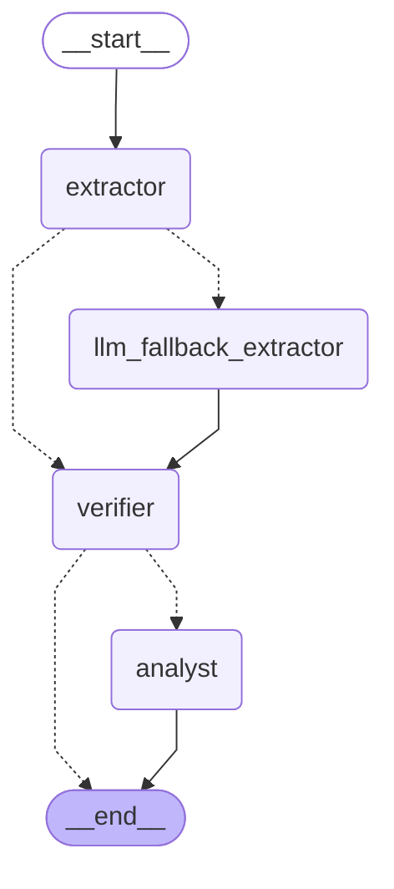

# reinsurance-treaty-agent
Reinsurance Treaty Analyzer Agent. Tech Stack: Python 3.11+, Pydantic v2, LangGraph (for deterministic agent orchestration), FastAPI (for API/services), Pytest (testing), Docker &amp; Streamlit (for easy deployment &amp; UI). AI Tooling: Claude Code (CLI) inside PyCharm, interacting with Claude 3.5 Sonnet via Anthropic API.

**Live demo**: [reinsurance-treaty-agent-extraction.streamlit.app](https://reinsurance-treaty-agent-extraction.streamlit.app/)

## Workflow Graph

The agentic workflow in `src/workflow.py` is a LangGraph state machine:
the Extractor Node reads treaty terms from parsed text via regex; if
it can't find one or more required fields (e.g. a treaty phrased as
prose instead of the `Label: value` convention), the LLM Fallback
Extractor Node retries the extraction using Claude Haiku 4.5 with
structured tool-use output before continuing. The Verifier Node then
checks completeness and (if complete) looks up historical claims for
the cedent, and the Analyst Node computes the loss ratio and flags
anomalies. If extraction is still incomplete after both attempts, the
graph ends right after the Verifier Node instead of running the
Analyst Node.

<!-- workflow-graph:start -->

<!-- workflow-graph:end -->

This diagram is regenerated automatically by a pre-commit hook whenever
`src/workflow.py` changes (see `scripts/regenerate_workflow_graph.py`
and `## Setup` below). To regenerate it by hand:

```bash
python3 scripts/regenerate_workflow_graph.py
```

## Setup

```bash
python3 -m venv venv
source venv/bin/activate   # Windows: venv\Scripts\activate
pip install -r requirements.txt
git config core.hooksPath .githooks
```

That last command enables `.githooks/pre-commit`, which automatically
regenerates the workflow graph diagram (above) in `README.md` whenever
`src/workflow.py` is part of a commit.

## Running the App

```bash
streamlit run src/app.py
```

Run this from the project root with the venv active. `src/app.py`
inserts the project root into `sys.path` itself at the top of the
file, before its `from src... import` statements — needed because
Streamlit's own script runner (`streamlit/web/bootstrap.py`) only adds
the script's own directory (`src/`) to `sys.path`, not the project
root, whichever way the app is launched (bare `streamlit run`,
`python3 -m streamlit run`, or Streamlit Community Cloud's own
launcher — see "Deployment" below). `python3 -m streamlit run
src/app.py` also still works, since `-m` additionally puts the project
root on `sys.path` in its own right.

Streamlit starts a local web server and prints a URL, typically:

```
Local URL: http://localhost:8501
```

Open that URL in a browser (it usually opens automatically). Leave the
command running in its terminal — the app stays up as long as that
process does; press `Ctrl+C` there to stop it.

### Using the app

1. **Upload a treaty PDF** via the "Treaty PDF" file uploader. Two mock
   fixtures ship in `data/` for trying it out: `sample_treaty.pdf`
   (minimal, 2 pages) and `sample_rich_treaty.pdf` (detailed, 4 pages,
   two layers — see [Sample Treaty Fixtures](#sample-treaty-fixtures)
   below).
2. The app runs the full agent workflow automatically on upload and
   renders the resulting anomaly report: treaty terms with page
   citations, the historical loss ratio, and any flagged findings. An
   unreadable/malformed PDF, or one missing required treaty terms,
   shows a clear error message instead of crashing.
3. Expand **"Debug: workflow execution"** below the report to see:
   - A per-node execution log (Extractor → Verifier → Analyst), each
     line timestamped.
   - The raw workflow state as JSON (parsed sections, extracted treaty
     terms, claims, the final report).
   - A save control: pick **Append** or **Overwrite**, then click
     **"Save logs to file"** to write the current run's log lines —
     prefixed with a header noting the run's date/time and uploaded
     file name — to `logs/workflow.log`. Append adds to that file's
     existing content; Overwrite clears it first.
4. To try another treaty, upload a different PDF — the app reruns
   automatically and replaces the report and debug panel with the new
   run's results.

## Deployment

The app is deployed on [Streamlit Community Cloud](https://share.streamlit.io/),
which is free and purpose-built for Streamlit apps, but has no public
deploy API — the app is created and updated through its web UI, not a
CLI or GitHub Action. It requires the GitHub repo to be **public**
(this repo is) — Community Cloud's free tier doesn't deploy from
private repos.

### First-time setup (manual, one-time)

1. Sign in at [share.streamlit.io](https://share.streamlit.io/) with
   GitHub.
2. Click **"Create app"** → **"Deploy a public app from GitHub"**.
3. Fill in:
   - **Repository**: `iva2020dev/reinsurance-treaty-agent`
   - **Branch**: `main`
   - **Main file path**: `src/app.py`
4. Click **Deploy**. The platform installs `requirements.txt` and runs
   `streamlit run src/app.py` from the repo root.
5. Add the **`ANTHROPIC_API_KEY`** secret: on the app's page, open
   **Settings → Secrets** and add
   `ANTHROPIC_API_KEY = "sk-ant-..."`. Extraction is regex-first (see
   `REASONING.md`'s `build-agentic-workflow-graph` entry) and needs no
   secret on its own, but the LLM fallback (`llm_fallback_extractor`,
   used when regex can't find required fields — see
   `implement-llm-fallback-node`) makes a real Anthropic API call and
   needs this key to work. Without it, the app still runs fine on
   well-formed treaties; on ones that need the fallback, the run
   degrades gracefully (an incomplete-extraction message) rather than
   crashing — it just can't actually recover via the LLM.
6. Once deployed, the app gets a permanent public URL
   (`https://<app-name>.streamlit.app`). This app is live at
   [reinsurance-treaty-agent-extraction.streamlit.app](https://reinsurance-treaty-agent-extraction.streamlit.app/).

### Keeping it up to date

Streamlit Community Cloud auto-redeploys on every push to `main` — no
separate deploy step is needed after the first setup. A push that adds
a new dependency to `requirements.txt` triggers a full reinstall on the
next redeploy.

### Compatibility note

Streamlit Cloud's launcher behaves like a bare `streamlit run src/app.py`
(not `python -m streamlit run`), which only adds `src/`'s own directory
to `sys.path`, not the repo root. `src/app.py` accounts for this itself
— it inserts the repo root into `sys.path` at the top of the file
before its `src.*` imports — so it resolves correctly under Streamlit
Cloud's launcher without needing the `-m` flag documented above for
local runs.

## Running Tests

Tests live under `tests/` and are run with `pytest` from the project root
(so `src/` and `data/` resolve as relative paths).

Run the full suite:

```bash
python3 -m pytest tests/
```

Run with per-test output (`-v`):

```bash
python3 -m pytest tests/ -v
```

Example output:

```
============================= test session starts ==============================
collected 41 items

tests/test_app.py::test_format_report_markdown_includes_terms_citations_and_findings PASSED [  2%]
tests/test_app.py::test_format_report_markdown_no_findings PASSED        [  4%]
tests/test_app.py::test_analyze_uploaded_pdf_success PASSED              [  7%]
tests/test_app.py::test_analyze_uploaded_pdf_malformed_raises_parser_error PASSED [  9%]
tests/test_app.py::test_app_upload_and_render_success PASSED             [ 12%]
tests/test_app.py::test_app_upload_malformed_pdf_shows_error_not_crash PASSED [ 14%]
tests/test_app.py::test_serialize_state_for_debug_is_json_safe PASSED    [ 17%]
tests/test_app.py::test_app_debug_panel_shows_log_lines_and_state_on_success PASSED [ 19%]
tests/test_app.py::test_app_debug_panel_shows_log_lines_on_parser_failure PASSED [ 21%]
tests/test_app.py::test_format_log_header_includes_timestamp_and_filename PASSED [ 24%]
tests/test_app.py::test_save_logs_to_file_overwrite_replaces_existing_content PASSED [ 26%]
tests/test_app.py::test_save_logs_to_file_append_keeps_existing_content PASSED [ 29%]
tests/test_app.py::test_save_logs_to_file_creates_parent_directory PASSED [ 31%]
tests/test_app.py::test_app_save_button_writes_default_log_file PASSED   [ 34%]
tests/test_integration.py::test_full_pipeline_success_minimal_treaty PASSED [ 36%]
tests/test_integration.py::test_full_pipeline_success_rich_treaty PASSED [ 39%]
tests/test_integration.py::test_full_pipeline_malformed_pdf_raises_parser_error PASSED [ 41%]
tests/test_integration.py::test_full_pipeline_unknown_cedent_handled_gracefully PASSED [ 43%]
tests/test_integration.py::test_full_pipeline_missing_required_term_handled_gracefully PASSED [ 46%]
tests/test_parser.py::test_extract_treaty_sections_handles_minimal_two_page_treaty PASSED [ 48%]
tests/test_parser.py::test_extract_treaty_sections_handles_rich_multi_page_treaty PASSED [ 51%]
tests/test_parser.py::test_extract_treaty_sections_handles_fuzzy_rich_treaty PASSED [ 53%]
tests/test_parser.py::test_extract_treaty_sections_raises_on_malformed_pdf PASSED [ 56%]
tests/test_parser.py::test_extract_treaty_sections_raises_on_missing_file PASSED [ 58%]
tests/test_tools.py::test_query_historical_claims_returns_claims_for_known_cedent PASSED [ 60%]
tests/test_tools.py::test_query_historical_claims_returns_empty_list_for_unknown_cedent PASSED [ 63%]
tests/test_tools.py::test_calculate_loss_ratio_known_inputs PASSED       [ 65%]
tests/test_tools.py::test_calculate_loss_ratio_empty_claims_is_zero PASSED [ 68%]
tests/test_tools.py::test_calculate_loss_ratio_claim_exceeding_layer_top_is_capped PASSED [ 70%]
tests/test_workflow.py::test_extractor_node_well_formed_input PASSED     [ 73%]
tests/test_workflow.py::test_extractor_node_flags_missing_fields PASSED  [ 75%]
tests/test_workflow.py::test_extract_treaty_terms_fails_on_fuzzy_prose_treaty PASSED [ 78%]
tests/test_workflow.py::test_llm_fallback_not_invoked_when_regex_succeeds PASSED [ 80%]
tests/test_workflow.py::test_llm_fallback_extractor_succeeds_on_fuzzy_treaty PASSED [ 82%]
tests/test_workflow.py::test_llm_fallback_extractor_degrades_gracefully_on_failure PASSED [ 85%]
tests/test_workflow.py::test_run_workflow_stays_incomplete_when_llm_fallback_also_fails PASSED [ 87%]
tests/test_workflow.py::test_verifier_node_complete_triggers_historical_claims_lookup PASSED [ 90%]
tests/test_workflow.py::test_verifier_node_flags_incompleteness_without_calling_tools PASSED [ 92%]
tests/test_workflow.py::test_analyst_node_no_anomalies PASSED            [ 95%]
tests/test_workflow.py::test_analyst_node_flags_at_least_one_anomaly PASSED [ 97%]
tests/test_workflow_graph_docs.py::test_readme_workflow_graph_matches_live_graph PASSED [100%]

============================== 41 passed in 1.94s ===============================
```

Run a single test file, e.g. just the parser tests:

```bash
python3 -m pytest tests/test_parser.py -v
```

Example output:

```
============================= test session starts ==============================
collected 5 items

tests/test_parser.py::test_extract_treaty_sections_handles_minimal_two_page_treaty PASSED [ 20%]
tests/test_parser.py::test_extract_treaty_sections_handles_rich_multi_page_treaty PASSED [ 40%]
tests/test_parser.py::test_extract_treaty_sections_handles_fuzzy_rich_treaty PASSED [ 60%]
tests/test_parser.py::test_extract_treaty_sections_raises_on_malformed_pdf PASSED [ 80%]
tests/test_parser.py::test_extract_treaty_sections_raises_on_missing_file PASSED [100%]

============================== 5 passed in 0.04s ===============================
```

Run a single test by name:

```bash
python3 -m pytest tests/test_parser.py::test_extract_treaty_sections_handles_minimal_two_page_treaty -v
```

Example output:

```
============================= test session starts ==============================
collected 1 item

tests/test_parser.py::test_extract_treaty_sections_handles_minimal_two_page_treaty PASSED [100%]

============================== 1 passed in 0.06s ===============================
```

Run both treaty-fixture tests by keyword, to compare the minimal and
rich fixtures side by side:

```bash
python3 -m pytest tests/test_parser.py -k "minimal_two_page_treaty or rich_multi_page_treaty" -v
```

Example output:

```
============================= test session starts ==============================
collected 5 items / 3 deselected / 2 selected

tests/test_parser.py::test_extract_treaty_sections_handles_minimal_two_page_treaty PASSED [ 50%]
tests/test_parser.py::test_extract_treaty_sections_handles_rich_multi_page_treaty PASSED [100%]

======================= 2 passed, 3 deselected in 0.03s ========================
```

Now clearly distinct, symmetric names — both pass:

| Test | Fixture | Pages | Checks |
|---|---|---|---|
| `test_extract_treaty_sections_handles_minimal_two_page_treaty` | `sample_treaty.pdf` | 2 | page 1 has "Attachment Point", page 2 has "EXCLUSIONS" |
| `test_extract_treaty_sections_handles_rich_multi_page_treaty` | `sample_rich_treaty.pdf` | 4 | page 1 cedent name, page 2 "Layer 1", page 3 "EXCLUSIONS", page 4 "Arbitration" |
| `test_extract_treaty_sections_handles_fuzzy_rich_treaty` | `sample_rich_fuzzy_treaty.pdf` | 4 | page 1 has "Sentinel Mutual", page 2 has "$2,500,000", page 3 "EXCLUSIONS", page 4 "Arbitration" |

Run just the tools tests (`query_historical_claims` and
`calculate_loss_ratio`, from `src/tools.py`):

```bash
python3 -m pytest tests/test_tools.py -v
```

Example output:

```
============================= test session starts ==============================
collected 5 items

tests/test_tools.py::test_query_historical_claims_returns_claims_for_known_cedent PASSED [ 20%]
tests/test_tools.py::test_query_historical_claims_returns_empty_list_for_unknown_cedent PASSED [ 40%]
tests/test_tools.py::test_calculate_loss_ratio_known_inputs PASSED       [ 60%]
tests/test_tools.py::test_calculate_loss_ratio_empty_claims_is_zero PASSED [ 80%]
tests/test_tools.py::test_calculate_loss_ratio_claim_exceeding_layer_top_is_capped PASSED [100%]

============================== 5 passed in 0.01s ===============================
```

| Test | Checks |
|---|---|
| `test_query_historical_claims_returns_claims_for_known_cedent` | "Acme Insurance Co." returns its 3 rows from `data/historical_claims.csv`, amounts sum correctly |
| `test_query_historical_claims_returns_empty_list_for_unknown_cedent` | An unmatched cedent name returns `[]`, not an error |
| `test_calculate_loss_ratio_known_inputs` | A claim below the attachment point cedes 0; a claim partially above it cedes the portion within the layer |
| `test_calculate_loss_ratio_empty_claims_is_zero` | No claims → ratio of `0.0` |
| `test_calculate_loss_ratio_claim_exceeding_layer_top_is_capped` | A claim far exceeding the layer's top is capped at the limit → ratio of `1.0` |

Run just the workflow tests (the Extractor/Verifier/Analyst nodes,
from `src/workflow.py`):

```bash
python3 -m pytest tests/test_workflow.py -v
```

Example output:

```
============================= test session starts ==============================
collected 11 items

tests/test_workflow.py::test_extractor_node_well_formed_input PASSED     [  9%]
tests/test_workflow.py::test_extractor_node_flags_missing_fields PASSED  [ 18%]
tests/test_workflow.py::test_extract_treaty_terms_fails_on_fuzzy_prose_treaty PASSED [ 27%]
tests/test_workflow.py::test_llm_fallback_not_invoked_when_regex_succeeds PASSED [ 36%]
tests/test_workflow.py::test_llm_fallback_extractor_succeeds_on_fuzzy_treaty PASSED [ 45%]
tests/test_workflow.py::test_llm_fallback_extractor_degrades_gracefully_on_failure PASSED [ 54%]
tests/test_workflow.py::test_run_workflow_stays_incomplete_when_llm_fallback_also_fails PASSED [ 63%]
tests/test_workflow.py::test_verifier_node_complete_triggers_historical_claims_lookup PASSED [ 72%]
tests/test_workflow.py::test_verifier_node_flags_incompleteness_without_calling_tools PASSED [ 81%]
tests/test_workflow.py::test_analyst_node_no_anomalies PASSED            [ 90%]
tests/test_workflow.py::test_analyst_node_flags_at_least_one_anomaly PASSED [100%]

============================== 11 passed in 0.32s ===============================
```

| Test | Checks |
|---|---|
| `test_extractor_node_well_formed_input` | Regex extraction reads cedent/attachment point/limit/premium/exclusions and their page citations from clean `Label: value` text |
| `test_extractor_node_flags_missing_fields` | Sections missing numeric fields return `treaty=None` plus the list of missing field names, instead of raising |
| `test_extract_treaty_terms_fails_on_fuzzy_prose_treaty` | The prose-phrased fuzzy fixture (same facts as the rich fixture) returns `treaty=None` and all four required fields as missing, since regex can't match `Label: value` patterns in natural prose |
| `test_llm_fallback_not_invoked_when_regex_succeeds` | Patching `llm_fallback_extractor` to raise if called confirms it never runs on a well-formed treaty |
| `test_llm_fallback_extractor_succeeds_on_fuzzy_treaty` | Given the fuzzy fixture's sections and a mocked successful Claude tool-use response, produces a valid `TreatyTerms` with `extraction_method="llm"` |
| `test_llm_fallback_extractor_degrades_gracefully_on_failure` | A simulated API failure returns `extraction_method="none"` and a populated `llm_error`, without raising |
| `test_run_workflow_stays_incomplete_when_llm_fallback_also_fails` | End-to-end: regex fails, the LLM fallback also fails (mocked), and the run ends with `complete=False`, not a crash |
| `test_verifier_node_complete_triggers_historical_claims_lookup` | A valid treaty triggers a real `query_historical_claims` call and returns the cedent's claims |
| `test_verifier_node_flags_incompleteness_without_calling_tools` | `treaty=None` marks the run incomplete and skips the tool call entirely (empty claims) |
| `test_analyst_node_no_anomalies` | A moderate loss ratio with claims data present produces `findings == []` |
| `test_analyst_node_flags_at_least_one_anomaly` | Zero historical claims produces a `LOW` "no historical data" finding |

Run just the integration tests — the full pipeline
(`run_workflow_from_pdf`/`run_workflow`, from `src/workflow.py`) with
no node mocking, both success and failure paths:

```bash
python3 -m pytest tests/test_integration.py -v
```

Example output:

```
============================= test session starts ==============================
collected 5 items

tests/test_integration.py::test_full_pipeline_success_minimal_treaty PASSED [ 20%]
tests/test_integration.py::test_full_pipeline_success_rich_treaty PASSED [ 40%]
tests/test_integration.py::test_full_pipeline_malformed_pdf_raises_parser_error PASSED [ 60%]
tests/test_integration.py::test_full_pipeline_unknown_cedent_handled_gracefully PASSED [ 80%]
tests/test_integration.py::test_full_pipeline_missing_required_term_handled_gracefully PASSED [100%]

============================== 5 passed in 0.13s ===============================
```

| Test | Checks |
|---|---|
| `test_full_pipeline_success_minimal_treaty` | `sample_treaty.pdf` end-to-end → loss ratio 0.3, no findings |
| `test_full_pipeline_success_rich_treaty` | `sample_rich_treaty.pdf` end-to-end → loss ratio 1.25, one `HIGH` finding |
| `test_full_pipeline_malformed_pdf_raises_parser_error` | A malformed PDF raises `ParserError`, not an unhandled exception |
| `test_full_pipeline_unknown_cedent_handled_gracefully` | A cedent with no historical claims produces a valid report with a `LOW` finding, not a crash |
| `test_full_pipeline_missing_required_term_handled_gracefully` | Treaty text missing required fields ends the run with `complete: False`, not a crash |

Run just the app tests — `src/app.py`'s Streamlit UI, its report
formatting/debug helpers, and the running app itself (via
`streamlit.testing.v1.AppTest`):

```bash
python3 -m pytest tests/test_app.py -v
```

Example output:

```
============================= test session starts ==============================
collected 14 items

tests/test_app.py::test_format_report_markdown_includes_terms_citations_and_findings PASSED [  7%]
tests/test_app.py::test_format_report_markdown_no_findings PASSED        [ 14%]
tests/test_app.py::test_analyze_uploaded_pdf_success PASSED              [ 21%]
tests/test_app.py::test_analyze_uploaded_pdf_malformed_raises_parser_error PASSED [ 28%]
tests/test_app.py::test_app_upload_and_render_success PASSED             [ 35%]
tests/test_app.py::test_app_upload_malformed_pdf_shows_error_not_crash PASSED [ 42%]
tests/test_app.py::test_serialize_state_for_debug_is_json_safe PASSED    [ 50%]
tests/test_app.py::test_app_debug_panel_shows_log_lines_and_state_on_success PASSED [ 57%]
tests/test_app.py::test_app_debug_panel_shows_log_lines_on_parser_failure PASSED [ 64%]
tests/test_app.py::test_format_log_header_includes_timestamp_and_filename PASSED [ 71%]
tests/test_app.py::test_save_logs_to_file_overwrite_replaces_existing_content PASSED [ 78%]
tests/test_app.py::test_save_logs_to_file_append_keeps_existing_content PASSED [ 85%]
tests/test_app.py::test_save_logs_to_file_creates_parent_directory PASSED [ 92%]
tests/test_app.py::test_app_save_button_writes_default_log_file PASSED   [100%]

============================== 14 passed in 0.67s ===============================
```

| Test | Checks |
|---|---|
| `test_format_report_markdown_includes_terms_citations_and_findings` | The rendered Markdown includes treaty terms, page citations, loss ratio, and a `[HIGH]` finding |
| `test_format_report_markdown_no_findings` | An empty findings list renders "No anomalies found." |
| `test_analyze_uploaded_pdf_success` | A real PDF fixture's bytes produce the correct `AnomalyReport` |
| `test_analyze_uploaded_pdf_malformed_raises_parser_error` | Garbage bytes raise `ParserError`, not a crash |
| `test_app_upload_and_render_success` | Uploading a real PDF fixture through the running app renders the cedent name, no exception |
| `test_app_upload_malformed_pdf_shows_error_not_crash` | Uploading a malformed PDF shows exactly one `st.error`, no exception |
| `test_serialize_state_for_debug_is_json_safe` | The debug `WorkflowState` dict (nested pydantic models included) round-trips through `json.dumps` |
| `test_app_debug_panel_shows_log_lines_and_state_on_success` | The debug expander shows per-node log lines and the full state as JSON on a successful run |
| `test_app_debug_panel_shows_log_lines_on_parser_failure` | The debug panel shows no log lines/state when a `ParserError` fires before any node runs |
| `test_format_log_header_includes_timestamp_and_filename` | The saved-log header string matches `"=== Run at <timestamp> \| file: <name> ==="` |
| `test_save_logs_to_file_overwrite_replaces_existing_content` | `mode="overwrite"` clears a log file's prior content |
| `test_save_logs_to_file_append_keeps_existing_content` | `mode="append"` preserves a log file's prior content |
| `test_save_logs_to_file_creates_parent_directory` | Saving to a log path whose parent directory doesn't exist yet creates it |
| `test_app_save_button_writes_default_log_file` | Clicking "Save logs to file" in the running app writes the header and log lines to `logs/workflow.log` |

## Sample Treaty Fixtures

`data/` holds hand-built mock treaty PDFs used by the parser tests,
each with its parsed output saved alongside it as JSON for inspection
without running any code:

| PDF | Parsed output | Pages | Content |
|---|---|---|---|
| `sample_treaty.pdf` | `sample_treaty_parsed.json` | 2 | Minimal: attachment point, limit, premium, exclusions |
| `sample_rich_treaty.pdf` | `sample_rich_treaty_parsed.json` | 4 | Detailed: parties/period/territory, two layers with reinstatements and brokerage, a 10-item exclusions list, and claims/arbitration/governing-law provisions |
| `sample_rich_fuzzy_treaty.pdf` | `sample_rich_fuzzy_treaty_parsed.json` | 4 | Same substantive facts as a real treaty (cedent Sentinel Mutual Assurance, attachment point/limit/premium, exclusions), but phrased as prose instead of the `Label: value` convention, so the regex Extractor Node genuinely fails to find any required field — used to exercise the LLM extraction fallback |
