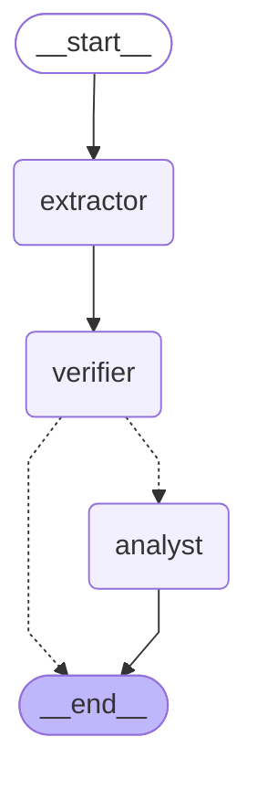

# reinsurance-treaty-agent
Reinsurance Treaty Analyzer Agent. Tech Stack: Python 3.11+, Pydantic v2, LangGraph (for deterministic agent orchestration), FastAPI (for API/services), Pytest (testing), Docker &amp; Streamlit (for easy deployment &amp; UI). AI Tooling: Claude Code (CLI) inside PyCharm, interacting with Claude 3.5 Sonnet via Anthropic API.

## Workflow Graph

The agentic workflow in `src/workflow.py` is a LangGraph state machine:
the Extractor Node reads treaty terms from parsed text, the Verifier
Node checks completeness and (if complete) looks up historical claims
for the cedent, and the Analyst Node computes the loss ratio and flags
anomalies. If extraction is incomplete, the graph ends right after the
Verifier Node instead of running the Analyst Node.

<!-- workflow-graph:start -->

<!-- workflow-graph:end -->

This diagram is regenerated automatically by a pre-commit hook whenever
`src/workflow.py` changes (see `scripts/regenerate_workflow_graph.py`
and `## Setup` below). To regenerate it by hand:

```bash
python3 scripts/regenerate_workflow_graph.py
```

## Setup

```bash
python3 -m venv venv
source venv/bin/activate   # Windows: venv\Scripts\activate
pip install -r requirements.txt
git config core.hooksPath .githooks
```

That last command enables `.githooks/pre-commit`, which automatically
regenerates the workflow graph diagram (above) in `README.md` whenever
`src/workflow.py` is part of a commit.

## Running Tests

Tests live under `tests/` and are run with `pytest` from the project root
(so `src/` and `data/` resolve as relative paths).

Run the full suite:

```bash
python3 -m pytest tests/
```

Run with per-test output (`-v`):

```bash
python3 -m pytest tests/ -v
```

Example output:

```
============================= test session starts ==============================
collected 21 items

tests/test_integration.py::test_full_pipeline_success_minimal_treaty PASSED [  4%]
tests/test_integration.py::test_full_pipeline_success_rich_treaty PASSED [  9%]
tests/test_integration.py::test_full_pipeline_malformed_pdf_raises_parser_error PASSED [ 14%]
tests/test_integration.py::test_full_pipeline_unknown_cedent_handled_gracefully PASSED [ 19%]
tests/test_integration.py::test_full_pipeline_missing_required_term_handled_gracefully PASSED [ 23%]
tests/test_parser.py::test_extract_treaty_sections_handles_minimal_two_page_treaty PASSED [ 28%]
tests/test_parser.py::test_extract_treaty_sections_handles_rich_multi_page_treaty PASSED [ 33%]
tests/test_parser.py::test_extract_treaty_sections_raises_on_malformed_pdf PASSED [ 38%]
tests/test_parser.py::test_extract_treaty_sections_raises_on_missing_file PASSED [ 42%]
tests/test_tools.py::test_query_historical_claims_returns_claims_for_known_cedent PASSED [ 47%]
tests/test_tools.py::test_query_historical_claims_returns_empty_list_for_unknown_cedent PASSED [ 52%]
tests/test_tools.py::test_calculate_loss_ratio_known_inputs PASSED       [ 57%]
tests/test_tools.py::test_calculate_loss_ratio_empty_claims_is_zero PASSED [ 61%]
tests/test_tools.py::test_calculate_loss_ratio_claim_exceeding_layer_top_is_capped PASSED [ 66%]
tests/test_workflow.py::test_extractor_node_well_formed_input PASSED     [ 71%]
tests/test_workflow.py::test_extractor_node_flags_missing_fields PASSED  [ 76%]
tests/test_workflow.py::test_verifier_node_complete_triggers_historical_claims_lookup PASSED [ 80%]
tests/test_workflow.py::test_verifier_node_flags_incompleteness_without_calling_tools PASSED [ 85%]
tests/test_workflow.py::test_analyst_node_no_anomalies PASSED            [ 90%]
tests/test_workflow.py::test_analyst_node_flags_at_least_one_anomaly PASSED [ 95%]
tests/test_workflow_graph_docs.py::test_readme_workflow_graph_matches_live_graph PASSED [100%]

============================== 21 passed in 0.16s ===============================
```

Run a single test file, e.g. just the parser tests:

```bash
python3 -m pytest tests/test_parser.py -v
```

Example output:

```
============================= test session starts ==============================
collected 4 items

tests/test_parser.py::test_extract_treaty_sections_handles_minimal_two_page_treaty PASSED [ 25%]
tests/test_parser.py::test_extract_treaty_sections_handles_rich_multi_page_treaty PASSED [ 50%]
tests/test_parser.py::test_extract_treaty_sections_raises_on_malformed_pdf PASSED [ 75%]
tests/test_parser.py::test_extract_treaty_sections_raises_on_missing_file PASSED [100%]

============================== 4 passed in 0.06s ===============================
```

Run a single test by name:

```bash
python3 -m pytest tests/test_parser.py::test_extract_treaty_sections_handles_minimal_two_page_treaty -v
```

Example output:

```
============================= test session starts ==============================
collected 1 item

tests/test_parser.py::test_extract_treaty_sections_handles_minimal_two_page_treaty PASSED [100%]

============================== 1 passed in 0.06s ===============================
```

Run both treaty-fixture tests by keyword, to compare the minimal and
rich fixtures side by side:

```bash
python3 -m pytest tests/test_parser.py -k "minimal_two_page_treaty or rich_multi_page_treaty" -v
```

Example output:

```
============================= test session starts ==============================
collected 4 items / 2 deselected / 2 selected

tests/test_parser.py::test_extract_treaty_sections_handles_minimal_two_page_treaty PASSED [ 50%]
tests/test_parser.py::test_extract_treaty_sections_handles_rich_multi_page_treaty PASSED [100%]

======================= 2 passed, 2 deselected in 0.04s ========================
```

Now clearly distinct, symmetric names — both pass:

| Test | Fixture | Pages | Checks |
|---|---|---|---|
| `test_extract_treaty_sections_handles_minimal_two_page_treaty` | `sample_treaty.pdf` | 2 | page 1 has "Attachment Point", page 2 has "EXCLUSIONS" |
| `test_extract_treaty_sections_handles_rich_multi_page_treaty` | `sample_rich_treaty.pdf` | 4 | page 1 cedent name, page 2 "Layer 1", page 3 "EXCLUSIONS", page 4 "Arbitration" |

Run just the tools tests (`query_historical_claims` and
`calculate_loss_ratio`, from `src/tools.py`):

```bash
python3 -m pytest tests/test_tools.py -v
```

Example output:

```
============================= test session starts ==============================
collected 5 items

tests/test_tools.py::test_query_historical_claims_returns_claims_for_known_cedent PASSED [ 20%]
tests/test_tools.py::test_query_historical_claims_returns_empty_list_for_unknown_cedent PASSED [ 40%]
tests/test_tools.py::test_calculate_loss_ratio_known_inputs PASSED       [ 60%]
tests/test_tools.py::test_calculate_loss_ratio_empty_claims_is_zero PASSED [ 80%]
tests/test_tools.py::test_calculate_loss_ratio_claim_exceeding_layer_top_is_capped PASSED [100%]

============================== 5 passed in 0.01s ===============================
```

| Test | Checks |
|---|---|
| `test_query_historical_claims_returns_claims_for_known_cedent` | "Acme Insurance Co." returns its 3 rows from `data/historical_claims.csv`, amounts sum correctly |
| `test_query_historical_claims_returns_empty_list_for_unknown_cedent` | An unmatched cedent name returns `[]`, not an error |
| `test_calculate_loss_ratio_known_inputs` | A claim below the attachment point cedes 0; a claim partially above it cedes the portion within the layer |
| `test_calculate_loss_ratio_empty_claims_is_zero` | No claims → ratio of `0.0` |
| `test_calculate_loss_ratio_claim_exceeding_layer_top_is_capped` | A claim far exceeding the layer's top is capped at the limit → ratio of `1.0` |

Run just the workflow tests (the Extractor/Verifier/Analyst nodes,
from `src/workflow.py`):

```bash
python3 -m pytest tests/test_workflow.py -v
```

Example output:

```
============================= test session starts ==============================
collected 6 items

tests/test_workflow.py::test_extractor_node_well_formed_input PASSED     [ 16%]
tests/test_workflow.py::test_extractor_node_flags_missing_fields PASSED  [ 33%]
tests/test_workflow.py::test_verifier_node_complete_triggers_historical_claims_lookup PASSED [ 50%]
tests/test_workflow.py::test_verifier_node_flags_incompleteness_without_calling_tools PASSED [ 66%]
tests/test_workflow.py::test_analyst_node_no_anomalies PASSED            [ 83%]
tests/test_workflow.py::test_analyst_node_flags_at_least_one_anomaly PASSED [100%]

============================== 6 passed in 0.16s ===============================
```

| Test | Checks |
|---|---|
| `test_extractor_node_well_formed_input` | Regex extraction reads cedent/attachment point/limit/premium/exclusions and their page citations from clean `Label: value` text |
| `test_extractor_node_flags_missing_fields` | Sections missing numeric fields return `treaty=None` plus the list of missing field names, instead of raising |
| `test_verifier_node_complete_triggers_historical_claims_lookup` | A valid treaty triggers a real `query_historical_claims` call and returns the cedent's claims |
| `test_verifier_node_flags_incompleteness_without_calling_tools` | `treaty=None` marks the run incomplete and skips the tool call entirely (empty claims) |
| `test_analyst_node_no_anomalies` | A moderate loss ratio with claims data present produces `findings == []` |
| `test_analyst_node_flags_at_least_one_anomaly` | Zero historical claims produces a `LOW` "no historical data" finding |

Run just the integration tests — the full pipeline
(`run_workflow_from_pdf`/`run_workflow`, from `src/workflow.py`) with
no node mocking, both success and failure paths:

```bash
python3 -m pytest tests/test_integration.py -v
```

Example output:

```
============================= test session starts ==============================
collected 5 items

tests/test_integration.py::test_full_pipeline_success_minimal_treaty PASSED [ 20%]
tests/test_integration.py::test_full_pipeline_success_rich_treaty PASSED [ 40%]
tests/test_integration.py::test_full_pipeline_malformed_pdf_raises_parser_error PASSED [ 60%]
tests/test_integration.py::test_full_pipeline_unknown_cedent_handled_gracefully PASSED [ 80%]
tests/test_integration.py::test_full_pipeline_missing_required_term_handled_gracefully PASSED [100%]

============================== 5 passed in 0.13s ===============================
```

| Test | Checks |
|---|---|
| `test_full_pipeline_success_minimal_treaty` | `sample_treaty.pdf` end-to-end → loss ratio 0.3, no findings |
| `test_full_pipeline_success_rich_treaty` | `sample_rich_treaty.pdf` end-to-end → loss ratio 1.25, one `HIGH` finding |
| `test_full_pipeline_malformed_pdf_raises_parser_error` | A malformed PDF raises `ParserError`, not an unhandled exception |
| `test_full_pipeline_unknown_cedent_handled_gracefully` | A cedent with no historical claims produces a valid report with a `LOW` finding, not a crash |
| `test_full_pipeline_missing_required_term_handled_gracefully` | Treaty text missing required fields ends the run with `complete: False`, not a crash |

## Sample Treaty Fixtures

`data/` holds two hand-built mock treaty PDFs used by the parser tests,
each with its parsed output saved alongside it as JSON for inspection
without running any code:

| PDF | Parsed output | Pages | Content |
|---|---|---|---|
| `sample_treaty.pdf` | `sample_treaty_parsed.json` | 2 | Minimal: attachment point, limit, premium, exclusions |
| `sample_rich_treaty.pdf` | `sample_rich_treaty_parsed.json` | 4 | Detailed: parties/period/territory, two layers with reinstatements and brokerage, a 10-item exclusions list, and claims/arbitration/governing-law provisions |
